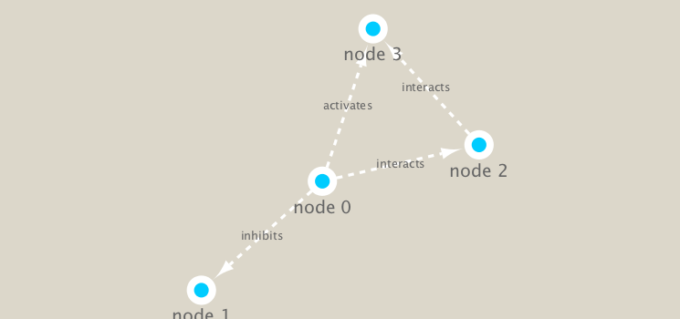

```{r setup, include=FALSE}
knitr::opts_chunk$set(echo = TRUE)
```

## Installing packages
## PT 2 Metagenomics co-occurrence networks 

Install packages

```{r eval=FALSE}
# BiocManager::install("RCy3") run in console
```


```{r}
library(RCy3)
library(igraph)
library(RColorBrewer)
```

Can we talk to cytoscape from R

```{r}
cytoscapePing()
```

We can test things further by making a small sample network (here in igraph format as used by the R igraph package) and sending it to Cytoscape:

```{r}
g <- makeSimpleIgraph()
createNetworkFromIgraph(g,"myGraph")
```

Switching Styles

```{r}
setVisualStyle("Marquee")
```

Lets save an image from cytoscape and include it in this document

```{r}
fig <- exportImage(filename="demo_marquee", type="png", height=350)


```

```{r}
plot(g)
```


##Read our metagenomics data

We will read in a species co-occurrence matrix that was calculated using Spearman Rank coefficient. (see reference Lima-Mendez et al. (2015) for details).


```{r}
## scripts for processing located in "inst/data-raw/"
prok_vir_cor <- read.delim("virus_prok_cor_abundant.tsv", stringsAsFactors = FALSE)

## Have a peak at the first 6 rows
head(prok_vir_cor)
```

```{r}
g <- graph.data.frame(prok_vir_cor, directed = FALSE)
plot(g) #a mess
```

This is a hot-mess! Lets turn off the blue text labels. And The nodes/vertex are too big. Lets make them smaller…

```{r}
plot(g, vertex.size=3, vertex.label=NA)
```

We can send this to cytoscape

```{r}
createNetworkFromIgraph(g,"myIgraph")
```

Network community detection

Community structure detection algorithms try to find dense sub-graphs within larger network graphs (i.e. clusters of well connected nodes that are densely connected themselves but sparsely connected to other nodes outside the cluster) . Here we use the classic Girvan & Newman betweenness clustering method. The igraph package has lots of different community detection algorithms (i.e. different methods for finding communities).


```{r}
cb <- cluster_edge_betweenness(g)
cb
```

```{r}
plot(cb, y=g, vertex.label=NA,  vertex.size=3)
```

## Notes

```{r}
# pipe writing
# dress(wash(wake("barry"))) # hard to read when things get really long

# %>%  can help visually separate the function, applies function to the x you specified in the first line

# wake("barry") %>% 
#  wash %>% 
#  dress %>% 
  
```


